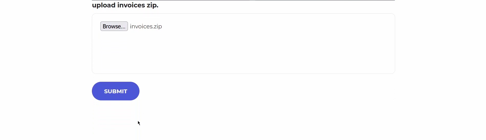
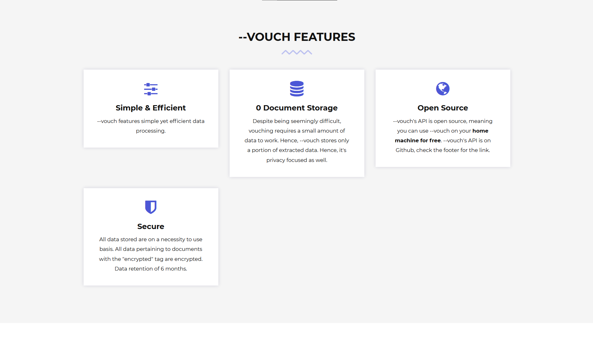
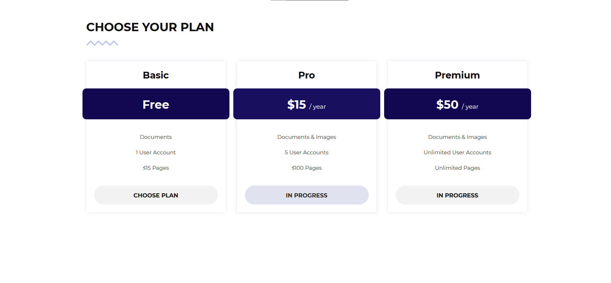

     <!-- Logo -->
    <h1>--vouch</h1> <!-- Title -->
    

      A web app aimed at automation via data extraction & data matching for vouching in the audit industry. Created to solve Challenge Statement 3 in Accounting Innovation Challenge 2021 (AIC21).
    
 <!-- Description -->
    

      Built With: •
    
 <!-- Built With -->

---

Table of Contents

- [Demo](#demo)
  - [Home](#home)
  - [Vouching Demo](#vouching-demo)
  - [Vouching Results](#vouching-results)
  - [Other Pages](#other-pages)

## Demo

### Home

### Vouching Demo

     

### Vouching Results

### Other Pages

 

## License <!-- omit in toc -->

This project is licensed under the terms of the MIT license.

## Credits <!-- omit in toc -->

- blvnk
